The Weather Sensory Data Prediction based on LSTM
=================================================

2011-13330 SNU CLS Seokmo-Yoo, August 2020.

Based on Long Short Term Memory(Sepp Hochreiter et al. 1997), which is effective model to predict time series data, I developed a simple prediction model of temperature and precipitation in weather sensory data. After training the model by observed data, I compared the result with the real data and analyzed the error of the result by numerical methods to discuss about accuracy.

## Methodology
Check out `snu2020-graduation-thesis.ipynb` for detail.
- using Tensorflow Keras in Python 3

## Model
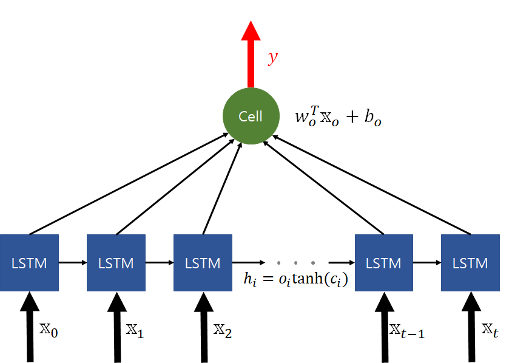

- Normalize to [-1, 1]
- LSTM Layer(Unit: 100)
- Dense Layer(Unit: 1)
- Denormalize 

## Result
### Average Temperature
`Accuracy: MSE 3.1986, R^2 0.9706`

- Total test set
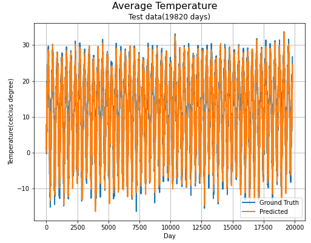

- Lastest 120 days test set
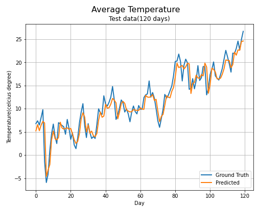

- Training loss by epochs
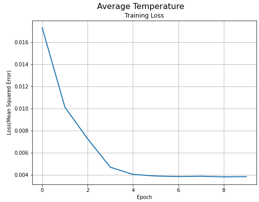

- Scatter plot of ground truths verus predicted values
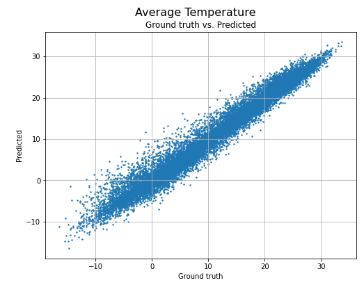

### Minimum Temperature
`Accuracy: MSE 3.7829, R^2 0.9656`
- Total test set
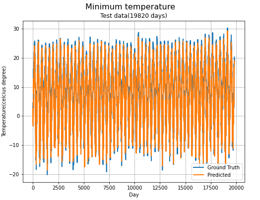

- Lastest 120 days test set
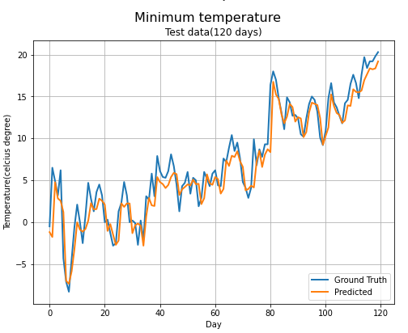

- Training loss by epochs
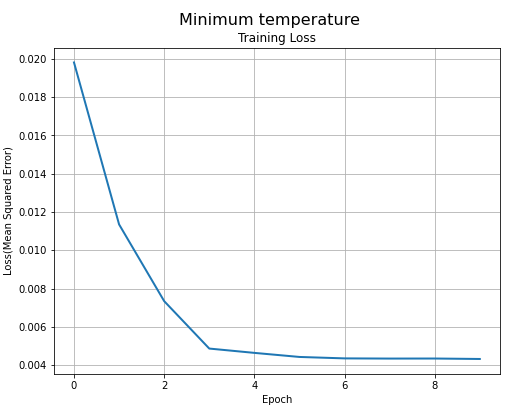

- Scatter plot of ground truths verus predicted values
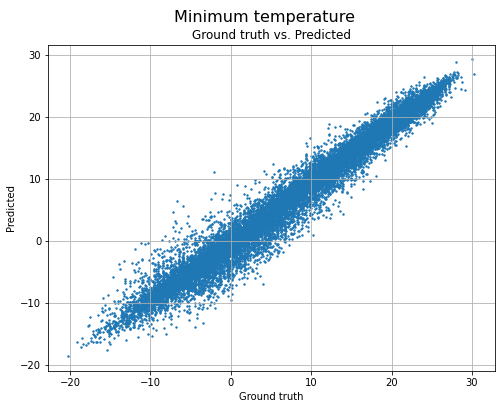

### Maximum Temperature
`Accuracy: MSE 5.3571, R^2 0.9530`
- Total test set
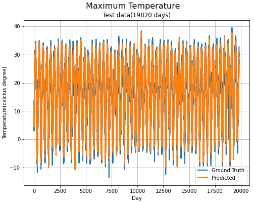

- Lastest 120 days test set
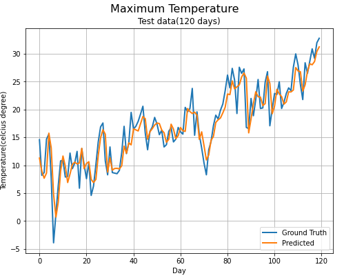

- Training loss by epochs
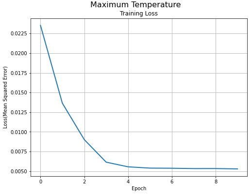

- Scatter plot of ground truths verus predicted values
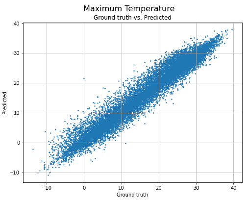

### Daily Precipitation
`Accuracy: MSE 181.0255, R^2 0.1642`
- Total test set
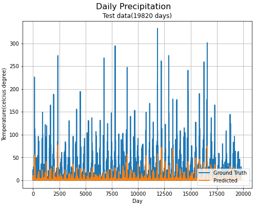

- Lastest 120 days test set
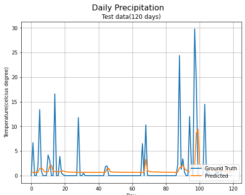

- Training loss by epochs
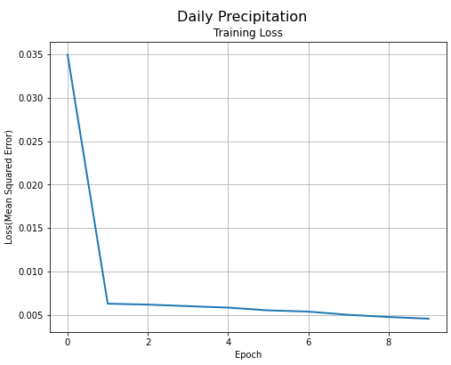

- Scatter plot of ground truths verus predicted values
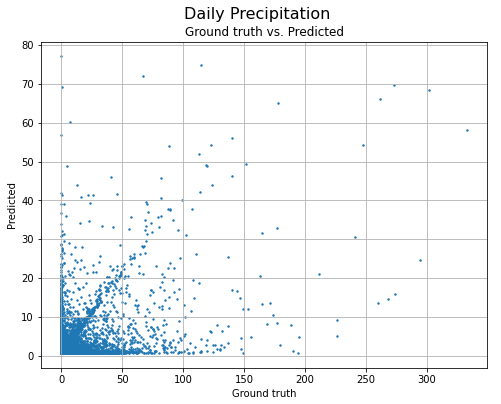
